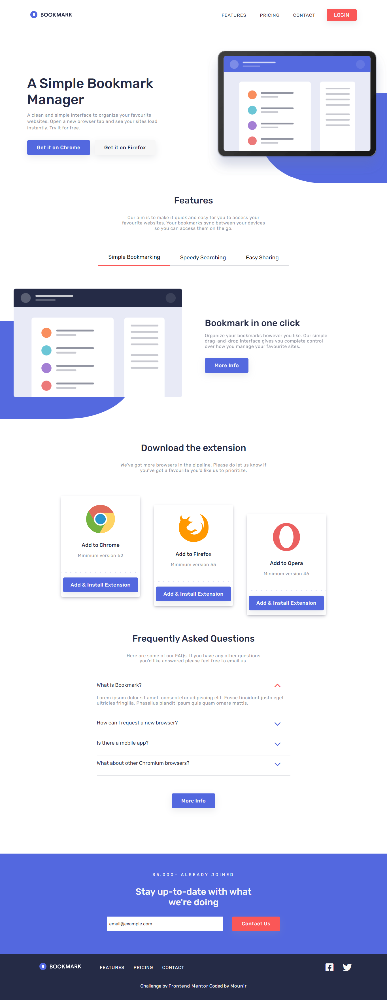
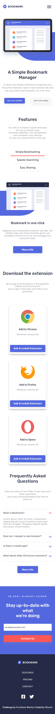
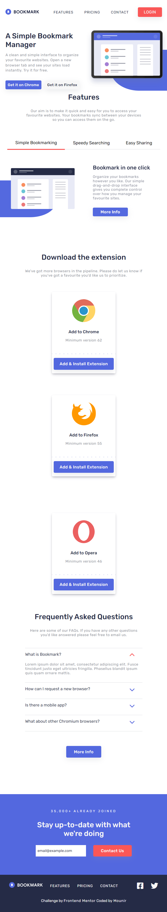

#Bookmark landing page

This is a solution to the [Bookmark landing page challenge on Frontend Mentor](https://www.frontendmentor.io/challenges/bookmark-landing-page-5d0b588a9edda32581d29158).

## Table of contents

- [Table of contents](#table-of-contents)
- [Overview](#overview)
  - [The challenge](#the-challenge)
  - [Links](#links)
  - [Screenshot](#screenshot)
- [My process](#my-process)
  - [Built with](#built-with)
  - [What I learned](#what-i-learned)
- [Author](#author)
## Overview

### The challenge

Users should be able to:

- View the optimal layout for the site depending on their device's screen size
- See hover states for all interactive elements on the page
- Receive an error message when the newsletter form is submitted if:
  - The input field is empty
  - The email address is not formatted correctly

### Links

- Live Site URL: [Add live site URL here](https://your-live-site-url.com)

### Screenshot

## My process

### Built with

- Semantic HTML5 markup
- SCSS
- Flexbox
- CSS Animation
- JavaScript ES6+

### What I learned

- email validation
- mobile navigation
- Create a sticky menu
- DOM Manipulation
  
## Author

- Github [@mounir-m4](https://github.com/mounir-m4)
- Twitter - [@mounirmotawakil](https://twitter.com/mounirmotawakil)
- Frontend Mentor - [@mounir-m4](https://www.frontendmentor.io/profile/mounir-m4)
